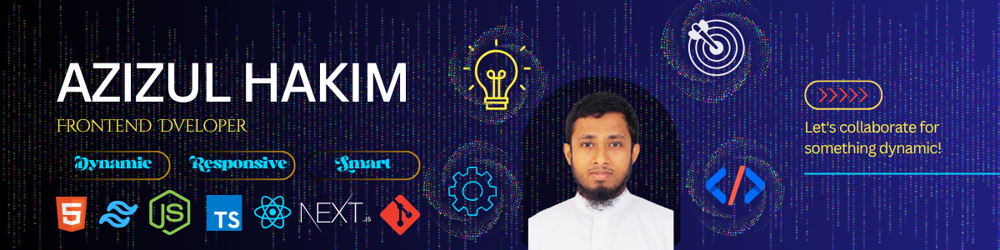

<!-- Header Banner with Dynamic Wave & Title -->

  

### 👨‍💻 About Me
I am a passionate **Full-Stack Web Developer** dedicated to engineering high-performance, responsive, and visually refined web applications. I focus on writing clean, modular code and solving architectural challenges with structured logic.

- 🔭 **Current Focus:** Developing scalable web platforms and real-world frontend ecosystems.
- 🌱 **Exploring & Mastering:** **Next.js**, Server Components, TypeScript architectures, and Supabase integration.
- 💬 **Ask Me About:** JavaScript (ES6+), React.js, State Management, Tailwind CSS, and REST APIs.
- ⚡ **Fun Fact:** I love combining the rigor of legal analytical logic with modular software engineering!

---

### 🌐 Connect with Me

  
  

---

### 🛠️ Tech Stack & Skills

**Languages & Frontend Core**

  

**Backend, Database & Tooling**

  

---

### 📊 GitHub Activity & Statistics

<!-- Working Real-Time Streak Stats -->

  

<!-- Live Metrics & Status Indicators -->

  
  
  

